# 🍍 PineappleWay

## Travel & Tourism Management Website

PineappleWay is a web-based Travel and Tourism Management System
developed as an internship project. It allows users to explore travel
packages, view package details, register and log in, make bookings,
manage profiles, and view booking history. Administrators can manage
packages, users, bookings, images, and booking statuses through a
dedicated dashboard.

## Project Objectives

-   Develop a user-friendly travel and tourism website.
-   Provide secure user registration and authentication.
-   Allow users to browse and book travel packages.
-   Store users, packages, and bookings digitally.
-   Provide an administrative dashboard for centralized management.
-   Implement CRUD operations for travel packages.
-   Provide booking status management.
-   Use MongoDB Atlas for cloud-based data storage.
-   Provide a responsive interface for desktop and mobile devices.

## Features

### User Features

-   Registration and login
-   Logout and session management
-   User dashboard
-   Profile management
-   Browse travel packages
-   View package details
-   Select travel date
-   Specify number of travelers
-   Add special booking requests
-   View My Bookings
-   Track booking status

### Admin Features

-   Admin login
-   Admin dashboard
-   Package statistics and management
-   Add, edit, and delete packages
-   Upload package images
-   Manage registered users
-   Manage bookings
-   Update booking status
-   Search and filter records

## Technology Stack

  Technology           Purpose
  -------------------- -------------------------------
  Python               Backend programming
  Flask                Web application framework
  MongoDB Atlas        Cloud database
  PyMongo              MongoDB integration
  HTML5                Page structure
  CSS3                 Styling
  Bootstrap 5          Responsive UI
  JavaScript           Client-side interactivity
  Jinja2               Dynamic templates
  Werkzeug             Password hashing and security
  Visual Studio Code   Development environment

## System Architecture

``` text
User / Admin
     |
     v
Web Browser
     |
     v
Flask Application
     |
     +----------------------+
     |                      |
     v                      v
User / Admin Modules    Business Logic
     |                      |
     +----------+-----------+
                |
                v
          PyMongo Driver
                |
                v
          MongoDB Atlas
```

## Project Structure

``` text
PineappleWay/
├── app.py
├── requirements.txt
├── routes/
├── templates/
├── static/
│   ├── css/
│   ├── js/
│   └── images/
├── uploads/
└── README.md
```

## Database

PineappleWay uses MongoDB Atlas as its cloud-based NoSQL database.

### Users Collection

Stores registered user information such as name, email, phone, password,
and account details.

### Packages Collection

Stores package name, destination, description, duration, price, hotel,
meals, guide, itinerary, included services, excluded services, and
package image.

### Bookings Collection

Stores booking ID, user ID, user details, package name, travel date,
number of travelers, special request, booking status, and creation date.

### Admin Collection

Stores administrator authentication information.

## Security

The application uses:

-   Password hashing with Werkzeug
-   Session-based authentication
-   Protected user routes
-   Protected administrator routes
-   Separate user and admin access
-   Server-side form processing
-   MongoDB Atlas authentication

Passwords are not stored as plain text.

## Installation and Setup

### 1. Open the Project

Open the PineappleWay project folder in Visual Studio Code.

### 2. Create a Virtual Environment

``` bash
python -m venv venv
```

Activate it on Windows:

``` bash
venv\Scripts\activate
```

### 3. Install Dependencies

``` bash
pip install -r requirements.txt
```

If a requirements file is unavailable:

``` bash
pip install flask pymongo werkzeug
```

### 4. Configure MongoDB Atlas

Create a MongoDB Atlas database and configure the connection string in
the application's configuration.

Do not upload database passwords or other secret credentials to GitHub.

### 5. Run the Application

``` bash
python app.py
```

Open:

``` text
http://127.0.0.1:5000
```

## Testing

The following major functionalities were tested:

-   User registration
-   User login
-   Invalid login handling
-   Package browsing
-   Package details
-   Booking creation
-   My Bookings
-   Profile management
-   Admin login
-   Package CRUD operations
-   Booking management
-   User management
-   Search and filtering
-   Image upload
-   Logout
-   Responsive interface

## Screenshots

Recommended screenshots for the repository:

``` text
screenshots/
├── 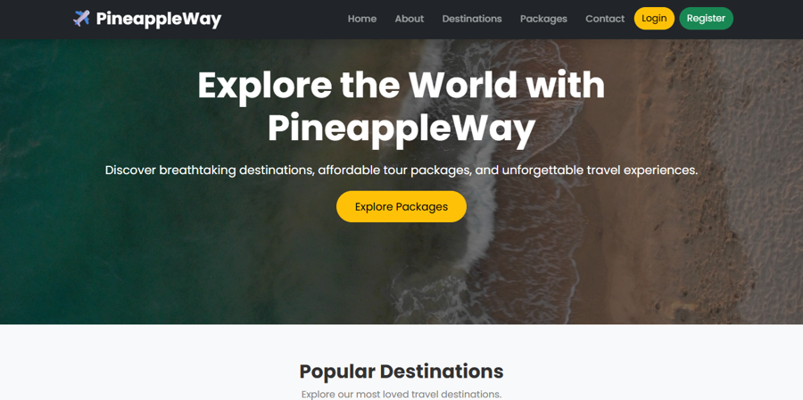
├── 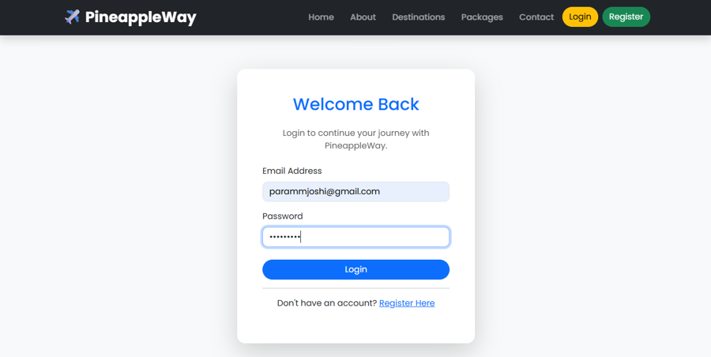
├── 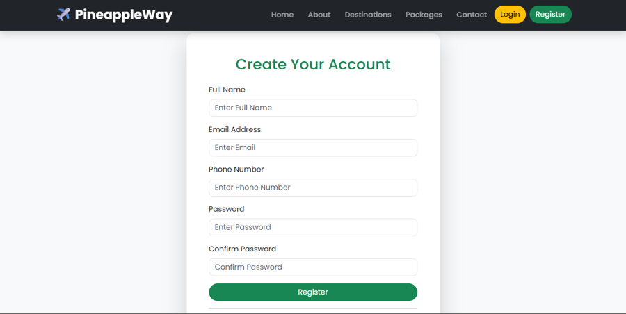
├── 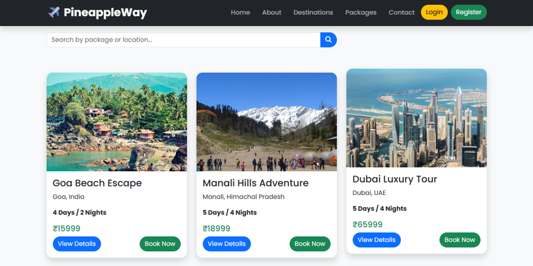
├── 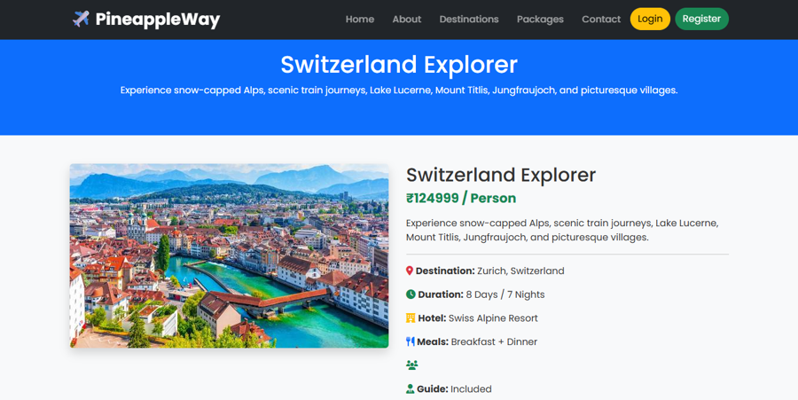
├── 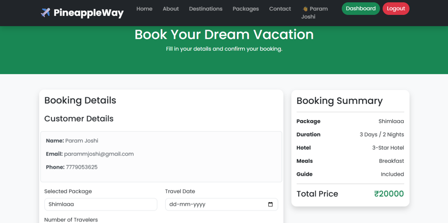
├── 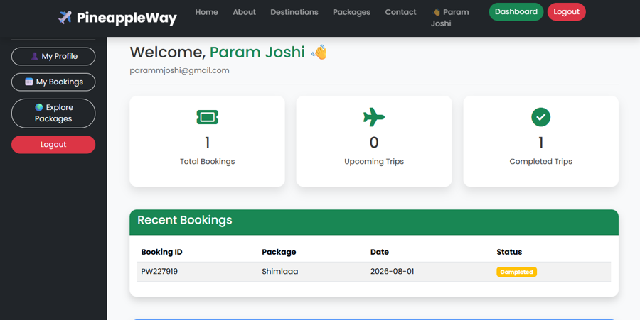
├── 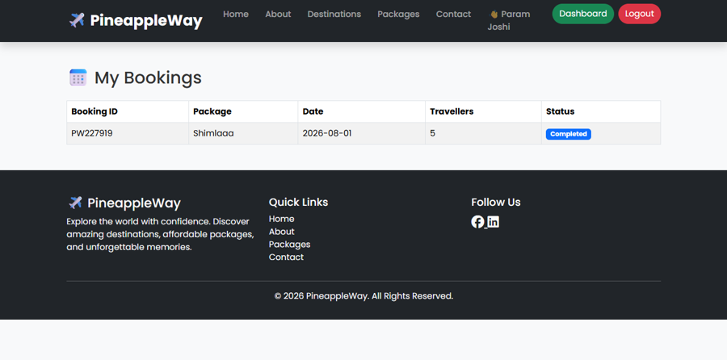
├── 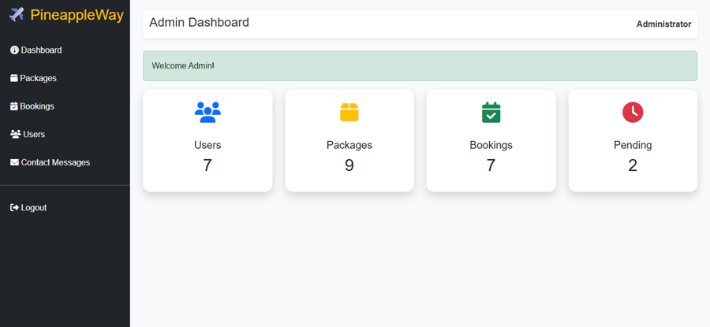
├── 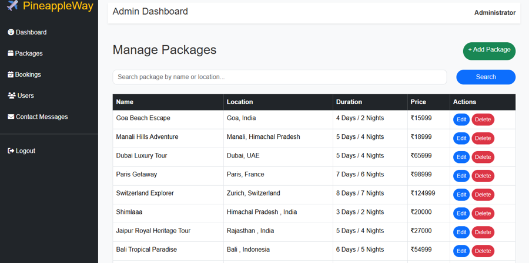
├── 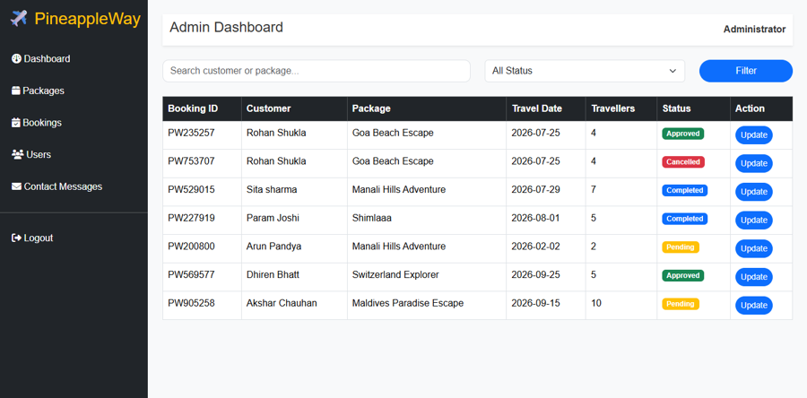
└── 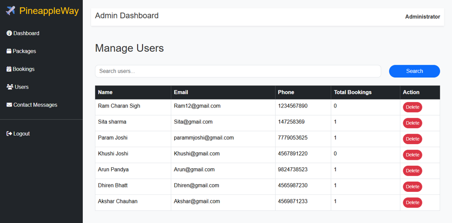
```

## Future Enhancements

-   Online payment gateway
-   Email and SMS notifications
-   OTP authentication
-   Hotel and flight API integration
-   AI-based travel recommendations
-   Reviews and ratings
-   Wishlist functionality
-   Google Maps integration
-   Mobile application
-   Multi-language support
-   Advanced analytics
-   Cloud deployment

## Project Documentation

The project documentation contains:

1.  Introduction
2.  Literature Survey
3.  Requirement Analysis
4.  System Design
5.  Technology Stack
6.  Implementation
7.  Testing
8.  Results and Discussion
9.  Future Enhancements
10. Conclusion

## AI-Assisted Development

OpenAI's ChatGPT was used as an AI-assisted learning and development
tool for understanding technical concepts, troubleshooting programming
errors, generating ideas, improving documentation, and refining written
content. The final application, implementation, testing, and design
decisions were reviewed and adapted by the author.

## Project Author

**Param Joshi**

MCA Student

**Project:** PineappleWay -- Travel & Tourism Management Website

## License

This project was developed for educational and internship purposes.
